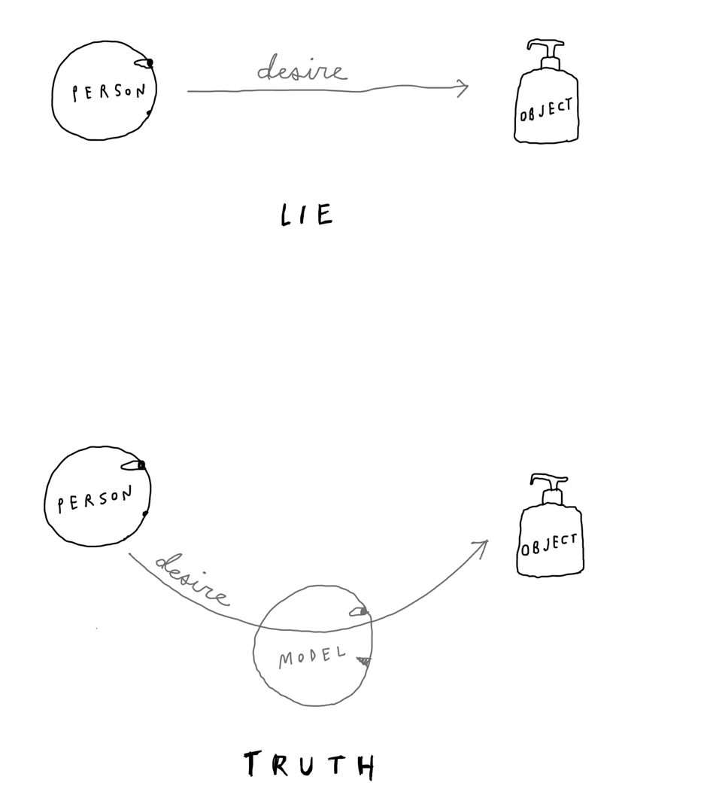

# Wanting: The Power of Mimetic Desire in Everyday life

Author: Luke Burgis

# Part I: The Power of Mimetic Desire

- Introduction: Social Gravity
    
    An unbeliever truth is often more dangerous than a lie.
    
    Girad discovered that we come to desire many things not through biological drives or pure reason, nor as a decree of our illusory and sovereign self but through imitation.
    
    But after meeting our basic needs as creatures, we enter into the human universe of desire. And knowing what to want is much harder than knowing what to need.
    
    Out of the billions of potential objects of desire in the world, from friends to careers to lifestyles, how do people come to desire some more than others?
    
    Models are people or things that show us what is worth wanting. It is models—not our “objective” analysis or central nervous system—that shape our desires. With these models, people engage in a secret and sophisticated form of imitation that Girard termed mimesis (mi-mee-sis), from the Greek word mimesthai (meaning “to imitate”).
    
    Gravity causes people to fall physically to the ground. Mimetic desire causes people to fall in or out of love, or debt, or friendships, or business partnerships. Or it may subject them to the degrading slavery of being merely a product of their milieu.
    
    Models of desire are what make Facebook such a potent drug. Before Facebook, a person’s models came from a small set of people: friends, family, work, magazines, and maybe TV. After
    
    Facebook, everyone in the world is a potential model.
    
    They are close enough for us to compare ourselves to them. They are the most influential models of all, and there are billions of them.
    
    the more people are alike, the more likely they are to feel threatened.
    
    The more people fight, the more they come to resemble each other. We should choose our enemies wisely, because we become like them.
    
- Chapter 1: Hidden Models
    - Romantic Lies, Infant Truth
        
        The **Romantic Lie** is self-delusion. The line between you and what you want isn’t straight, it’s curved. Buried in a deeper layer of our psychology is the person or thing (model) that caused us to want something in the first place. 
        
        **Models** transfigure objects before our eyes. They suggest desires. 
        
        
        
        **Models** get their desires from other models. If you go back far enough in the evolution of your desire, you will keep finding models.
        
        > Eve originally had no desire to eat the fruit from the forbidden tree—until the serpent modeled it.
        > 
        
        We never see the things we want directly, because they aren’t readily within reach. The greater the obstacle, the greater the attraction. 
        
        <aside>
        💡 The way a model suggests something makes all the difference. We are attracted to things when they are modeled to us in an attractive way, by the right model.
        
        </aside>
        
        Our universe of desire if as big or as small as our models.
        
        Dependence on models isn’t necessarily a bad thing, the danger is not recognizing them for what they are and allowing them to exert an outsize influence on us. 
        
    - Secrets Babies Keep
        
        Babies are brilliant imitators and a baby’s imitative power starts developing even before birth. Andrew Meltzoff’s work suggests that we don’t learn how to imitate; we are born imitators.
        
        Desire is our primordial concern. Long before people can articulate why they want something, they start wanting it. 
        
        Mimetic desire might have some neurological basis in mirror neurons, but can’t be reduced to that alone. 
        
        [Mirror neurons are a class of neuron that modulate their activity both when an individual executes a specific motor act and when they observe the same or similar act performed by another individual.](https://www.ncbi.nlm.nih.gov/pmc/articles/PMC3898692/)
        
        We notice the slightest deviance from what we call ***acceptable imitation.*** 
        
        - If we receive a response to a text that doesn’t sufficiently tone-match, we can go into a mini-crisis (Does she not like me? Does he think he’s superior to me? Did I do something wrong?)
        
        Communication runs on mimesis.
        
        - In a study published in 2008 in the Journal of Experimental Social Psychology, sixty-two students were assigned to negotiate with other students. **Those who mirrored others’ posture and speech reached a settlement 67 percent of the time, while those who didn’t reached a settlement 12.5 percent of the time.**
        
        <aside>
        💡 The imitation of superficial things is part of everyday life but don’t let it suck you into a blackhole in the universe of desire.
        
        </aside>
        
    - The Martini is a Gateway Drug
        
        Mimetic desire operates in the dark. We’re secretly on the lookout for models while simultaneously denying that we need any. 
        
    - Torches of Freedom
        
        <aside>
        💡 Models are most powerful when they are hidden.
        
        </aside>
        
        If you want to make someone passionate about something, they have to believe the desire is their own. 
        
    - Mimetic Games
        
        A way to identify people who might be modeling rivalrous or unhealthy behaviors is by thinking seriously about the people you least want to see succeed.
        
        People don’t only model the desire for third parties or objects; they can also model the desire for themselves.
        
        Romance can feel like a roller-coaster ride because that’s how mimetic desire moves.
        
        Sometimes the most important things in our lives come easily—they seem like gifts—while many of the least important things are the ones that, in the end, we worked the hardest for. 
        
        Big Tech companies do something similar. They present their technology as agnostic—as just a “platform.” And that’s true, so long as we evaluate it in a materialistic way, as bits and bytes. Yet, on a human level, social media companies have built engines of desire.
        
    - Models that Move Markets
        
        In both bubbles and crashes, models are multiplied.
        
        Bubbles are neither rational or irrational; they are profoundly human, and they will always be with us. 
        
    
- Chapter 2: Distorted Reality
    - We’re all freshmen again
        
        People are drawn to others who seem to play by different rules.
        
        We are generally fascinated with people who have a different relationship to desire, real or perceived. 
        
    - Two kinds of models
        
        Our ability to imitate in complex ways is why we have language, recipes, and music. 
        
        Everyone is flattered by imitation, being copied too closely feels threatening. 
        
        We are more threatened by people who want the same things as us than by those who don’t.
        
        Rivalry is a function of proximity. When people are separated from us by enough time, space, money, or status, there is no way to compete seriously for the same opportunities.
        
    - Celebristan
        
        In this kind of model, there is always a barrier that separates the models from their imitators, because there is no threat of conflict, they are generally imitated freely and openly.
        
    - Freshmanistan
        
        In this kind, there are no barriers preventing people from competing directly with one another for the same things.
        
        Shakespeare often portrayed mimetic desire in comedies because it’s more palatable for people that way—they can laugh at others behaving ridiculously from a safe distance, without being reminded of their own mimesis.
        
        Mimetic desire is both the bond and the bane of many friendships. The same force that drew them together, now pushes them apart as they try to differentiate themselves. 
        
    
    
    
    - Distortions of Reality
        - Distortion 1: The misappropriation of Wonder
            
            In Freshmanistan, people occupy the same space as their models, so they have to wonder at them in secret amazement.
            
            The metaphysical nature of desire leads to strange distortions in the way that we see other people.
            
            **The Worship of Cats**
            
            Why did the Egyptians worship cats? 
            
            The reasons are complex. But mimetic theory offers a hint: cats seem far less needy than we are. 
            
            While we toil away to fulfill our ever-changing desires, the cat grooms itself. It needs nothing, wants nothing.
            
            It is God like. Already fufilled. Unlike us. 
            
        - Distortion 2: The Cult of Experts
            
            Liquid modernity is a chaotic phase of history in which there are no culturally agreed-upon models to follow, no fixed points of reference.
            
            What is our basis for taking a source as authoritative? Is it because we checked all of the person’s credentials? Is it because the source was fact-checked by Peter Canby’s team at the New Yorker? Or is it because the person has the most followers on social media and a “Verified” sticker next to their name?
            
            The fastest way to become an expert is to convince a few of the right people to call you an expert.
            
            Every once in a while, then, it’s good to deconstruct the mimetic layers behind someone’s authority and think seriously about how we chose our sources of knowledge in the first place.
            
            **Find sources of wisdom the withstand mimesis**
            
            Increasingly, experts are crowned mimetically, like fashion.
            
            Find sources that have stood the test of time. Be wary of self-proclaimed and crowd-proclaimed experts.
            
            The key is carefully curating our sources of knowledge so that we are able to get down to what is true regardless of how many other people want to believe it. And that means doing the work.
            
        - Distortion 3: Reflexivity
            
            > Principle of reflexivity:
            > 
            > 
            > “In situations that have thinking participants, there is a two-way interaction between the participant’s thinking and the situation in which they operate,”
            > 
            
            Reflexivity in markets is partly what leads to market crashes and bubbles. Investors perceive there might be a crash, so they behave in a way that precipitates the crash.
            
            People worry about what other people will think before they say something—which affects what they say. In other words, our perception of reality changes reality by altering the way we might otherwise act. This leads to a self-fulfilling circularity.
            
            <aside>
            💡 Spiral of Silence:  people’s willingness to speak freely depends upon their unconscious perceptions of how popular their opinions are.
            
            </aside>
            
            The reflexivity of desire is most apparent in rivalrous relationships.
            
            In Freshmanistan, a mimetic rivalry is like two people trying to race each other inside of the same car: Nobody gets ahead, and eventually they crash.
            
            The mimetic rivalry between Tupac and Biggie ended with both of them dead. When mimesis is strong enough, rivals forget about whatever objects they were fighting for in the first place.
            
            **Mirrored Imitation**
            
            Why do all hipsters look alike, and why does nobody identify themselves as one?
            
            <aside>
            💡 Mirrored imitation, then, is imitation that does the opposite of whatever a rival does.
            
            </aside>
            
            When mimetic rivals are caught in a double bind, obsessed with each other, they go to any length to differentiate themselves.
            
            **Create boundaries with unhealthy models**
            
            You probably follow at least a few people who function as unhealthy models of desire for you.
            
            Unfollow them. Don’t ask about them. 
            
        - Social Mediation
            
            What we commonly call “social media” is more than media—it’s mediation: thousands of people showing us what to want and coloring our perception of those things.
            
            The danger is that we have a dream machine in our pockets.
            
            The neurological addictiveness of smartphones is real; but our addiction to the desires of others, which smartphones give us unfettered access to, is the metaphysical threat.
            
            Mimetic desire is the real engine of social media.
            
- Chapter 3: Social Contagion
    - Cycles of Desire
        
        Few things are more mimetic than aggression. 
        
        According to Shakespeare, people fight when they are similar.
        
        <aside>
        💡 Mimetic conflict is contagious. It can lead to a social environment in which everyone is reacting mimetically to everyone else. This keeps people locked in cycles of endless conflict. Desire spreads like energy from person to person.
        
        </aside>
        
    - Lamborghini versus Ferrari
        
        > Ferruccio Lamborghini
        > 
        > 
        > “I don’t invent anything,” Lamborghini bragged. “I start where the others came from.”
        > 
        > Burgis, Luke. Wanting (p. 71). St. Martin's Publishing Group. Kindle Edition.
        > 
        
        There’s a false division between imitation and innovation. Some of history’s most creative geniuses started off by simply imitating the right model.
        
        Being different for the sake of being different is the spirit of shock-value art. 
        
        There’s great stuff out there, why wouldn’t we learn from it?
        
        **Embrace influence instead of running away from it.** 
        
        Know when to lean into mimesis.
        
        In a mimetic rivalry, a person’s rival is like Zeus (forcing Sisyphus to push a boulder up a mountain for eternity) or a matador (orchestrating a bull).
        
        Lamborghini took specific measures to mitigate the negative effects of rivalry. It saved him from death of the bull.
        
        Competition can be good up to a certain point.
        
    - Memes and Mimetic Theory
        
        In 1976 Charles Darwin coined the word “meme”: cultural units of information that spread from person to person through a process of imitation. 
        
        According to Girard: we don’t care about what is being modeled as much as we care about who is modeling it. We imitate for the sake of differentiating ourselves— to try to forge an identify relative to other people. 
        
        **In meme theory, imitation is at worst something neutral. In mimetic theory, imitation can have negative consequences because when people compete for the same things, it can easily lead to conflict.** 
        
    - The Flywheel effect
        
        Mimetic desire tends to move in one of two cycles.
        
        - Cycle 1 is negative and leads to rivalry and conflict. It runs on the believe that other people have something we don’t and there there isn’t room for fulfillment of both their and out desires. It comes from a mindset of scarcity, fear, and anger.
        - Cycle 2 is positive and leads to unity and shared desire for common good. In comes from a mindset of abundance and mutual giving. It can transform the world.
        
        There is not a linear process of continuous improvement but a critical transition point at which momentum takes over and the process beings to power itself. 
        
        Mimesis works like a flywheel. It accelerates in a nonlinear way, in both positive and negative cases. 
        
    - The creative cycle
        - Invent great products, get elite athlete to use them, inspire weekend warriors to mimic their heroes, attract mainstream customers, and build brand power as more and more athletes use the product.
        - The fitness flywheel is hard to turn in the beginning. You feel like crap. Going to the gym seems daunting. And when you first start working out, it’s painful. Change is imperceptible. But you keep pushing, and eventually the wheel starts turning. One day you wake up and look forward to your workout. The momentum has taken hold.
        - Entelechy: a vital force that propels it forward to become fully what it is. Aristotle.
        - Negative flywheels are far more common than positive ones.
        
        **Start positive flywheels of desire**
        
        - The choices we make today affect the things we’ll want tomorrow.
        1. I want to hit 160lbs so that I can have more energy, be more confident, and dress nicer so 
        2. My videos will be more frequent and more effective because of my energy, confidence, and style so that
        3. I can make more of an impact with my content so that
        4. I can grow and massive audience, help more of them, learn more tech myself, get rewarded at work, so that
        5. I’ll want to do healthier things.
    - The destructive cycle
        
        When people deny that they are affected by what other people around them want, they are most susceptible to getting drawn into an unhealthy cycle of desire that they don’t even know to resist.
        
        It’s presumptuous for anyone to think that they can “deliver happiness” to anyone else—even their own spouse. It’s not our job. It’s certainly not the job of a company.
        
        It’s human to want to belong to an inner ring.
        
    - Hierarchical Values
        
        No aspect of human ecology is more overlooked than mimetic desire.
        
        Leaders should also consider that economic incentives are always more than economic.
        
        You can’t buy desire.
        
        Values and desires are not the same thing. 
        
        - Values act to order desires the way they do a diet.
        - Our minds think in hierarchies all the time. Without them, we can’t even being to think about what to pay attention to and to what degree.
        - If values are equally important, mimesis becomes the primary driver of decision-making.
        
        > 
        > 
        > 
        > If the company is in an industry where sales happen within an old-boys’ club, where trust has already been established between its members, how can they hire a young woman for a sales role and give her a chance to build up trust in a different way if there is not a clear priority on inclusiveness and diversity in the hiring process. Mimetic forces will continue to dominate their sales force.
        > 
        - When all vales are the same, nothing is being valued at all.
        
        Remember that conflict is caused by sameness, not by difference. If everything is equally good or important, the propensity for conflict is higher.
        
        Burgis, Luke. Wanting (p. 96). St. Martin's Publishing Group. Kindle Edition.
        
        **What are your values**
        
        - Will it make someone I love happy?
        - Is it the right thing to do?
        - Will it help people learn more about cloud?
        - Can it be used on both reactor and gps youtube?
        
    - The Collapse of Desire
        
        Value systems with a clear hierarchy are more effective during crises than systems of values that lack a hierarchy.
        
        When mimetic escalation reached a frenzied state, Lamborghini did something seldom done during a time of peak desire: he quit. He could do so because he was checking his desires against a clear hierarchy of values, which prevented them from spinning out of control.
        
        Burgis, Luke. Wanting (p. 97). St. Martin's Publishing Group. Kindle Edition.
        
        In downtown Las Vegas, where there was confusion about who was a model to whom, one model stood out from the rest: Tony himself.
        
        Burgis, Luke. Wanting (p. 97). St. Martin's Publishing Group. Kindle Edition.
        
        In mimetic theory, there is a near-indissoluble link between chaos and order, violence and the sacred.
        
        Burgis, Luke. Wanting (p. 98). St. Martin's Publishing Group. Kindle Edition.
        
        The fourth and final stage of the mimetic cycle, which we turn to now, is the process by which chaotic desires become orderly desires in human societies: the scapegoat mechanism.
        
        Burgis, Luke. Wanting (p. 98). St. Martin's Publishing Group. Kindle Edition.
        
- Chapter 4: The Invention of Blame
    - Scapegoats are chosen through a mimetic process of judgement, not a rational one.
    - The first stone is the only one without a mimetic model.
    - It is always easier to desire something—even, and maybe even especially, violence—when it has been desired by someone else first.
    - Anger spreads faster than other emotions, such as joy, because anger spreads easily when there are weak ties between people—as there often are online.
    - If you’re taking a poll or a vote in a public place, it’s essential that people cannot see how other people are voting.
    - There is probably no more effective thing that a politician—or potential politician—can do to gain popular support than resolving a mimetic crisis.
    - Reality TV uses the scapegoat mechanism: creating disorder, allowing mimetic tension to reach a peak, then expelling or sacrificing something symbolic.
    - The sacrifice of animals has gradually been replaced by the termination of executives, mass incarceration, and social media cancellations.
    - Nearly all people are religious in the sense that they subconsciously believe that sacrifice brings peace. Our violence is good, the violence of the other side is always bad.
    - The crucifixion of Jesus failed to unite a community unanimously against a scapegoat.
    - If the modern world seems to be going crazy, it’s partly due because we are hyperaware of the ways in which exploitation and violence against innocent victims occur, but we simply don’t know what to do about them. That is a recipe for collective madness.
    - Western culture has developed strongly around the defense of victims.
    - The culture wars are a giant mimetic rivalry with many faces, a hydra, a thousand heads.
    - The original scapegoat mechanism brought order out of chaos, the order depended on violence.
    - The line dividing good and evil cuts through the heart of every human and who is willing to destroy a piece of his own heart?
    - New scapegoats are made daily.
    - 

## Part II: The transformation of desire

- Chapter 5: Anti-mimetic, feeding the people not the system
    - The scapegoat mechanism works by diversion: the more we see it in others, the less we see it in ourselves.
    - **Being anti-mimetic:** having the ability to counteract destructive forces of desire.
    - We fall to the level of our systems. From the standpoint of desire, our goals are the product of our system. We can’t want something outside the system of desire we occupy.
    - Goals can easily turn into instruments of self-flagellation.
    - Goals are often chose for us by models, and that means goalposts are always moving.
    - Every goal is embedded within a system.
- Chapter 6: Disruptive empathy
    - Mimetic desire sustains: social media, the venture capital industry, US education system.
        - Many high schools have the goal of 100% college placement even though many university students feel they are no longer getting the value for their money.
        - VCs look for instant ramen, not risotto, because they favor companies that can scale quickly (tech).
        - This increases the attractiveness of tech start ups to entrepreneurs.
            - A mimetic system takes shape.
            - Economic incentive, financial returns, and prestige and validation that come with being financed by the right VC.
        - The greater the mimetic forces on a social media platform, the more people want to use it.
            - the platform wins if people argue on it.
    - **Mark visible what is invisible. Mark the boundaries of your current world of wanting, and you’ll gain the ability to transcend it.**
        - Followers, likes, subs, metrics.
        - Work less.
        - Seen as leaders.
        - Not care for gimmicks that increase metrics quickly.
        - Work the same amount, but stay my course.
        - Provide rich content that informs concisely.
- Chapter 7: Transcendent leadership
    - Skill 1: Shift Gravity
        - Transcendent leaders shift the gravity away from themselves to a transcendent goal so they can stand shoulder to shoulder with others.
        - Good teachers awaken dormant desires and awaken new ones.
        - A good leader never becomes an obstacle or a rival.
    - Skill 2: The Speed of Truth
        - Real trust is anti-mimetic by nature, it doesn’t change depending on how mimetically popular or unpopular it is.
        - In times of crisis, the threat from inside a system is underestimated.
        - The health of any human project relies on the ability to adapt depends on the speed at which the truth travels.
        - 
    - Skill 3: Discernment
        - When we decide to cut one thing, we necessarily cut away another. If there is no cutting, we haven’t done any deciding at all.
        - Discernment means to distinguish, and it’s the ability to choose the better path between options.
        - Helpful when distinguishing:
            - Which desire gives a fleeting feel of satisfaction, and which give satisfaction that endures?
            - Which one is more generous and loving?
            - Put yourself in your deathbed, which one would you have been more happy following?
            - Where does a desire come from?
    - Skill 4: Sit quietly in a room
        
        Silence is where we learn to be at peace with ourselves. Where we learn the truth about who we are and what we want.
        
    - Skill 5: Filter Feedback
        
        Transcendent leaders are first and foremost responsive to thick desires. 
        
- Chapter 8: The Mimetic Future
    
    It’s not difference but sameness that terrifies us. 
    
    We cannot want what we lack a model for.
    
    What we want in the future depends on the choices we make today.
    
    By the time you go to bed, you will have made it a little easier or a little harder to want something tomorrow. 
    
    People’s desires are artificially shaped by external forces.
    
-